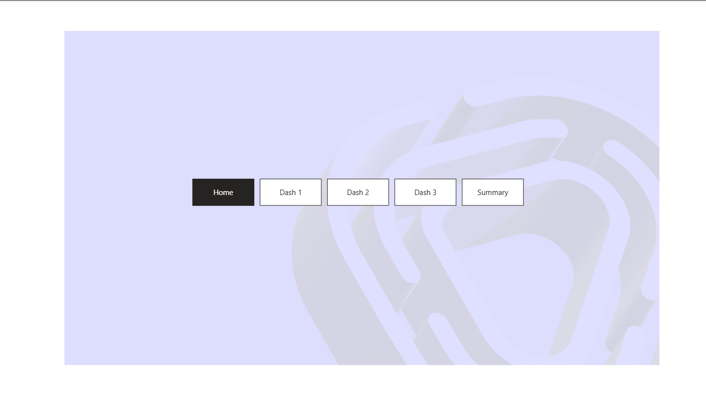
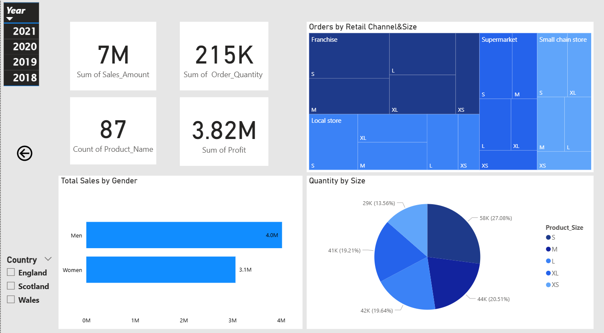
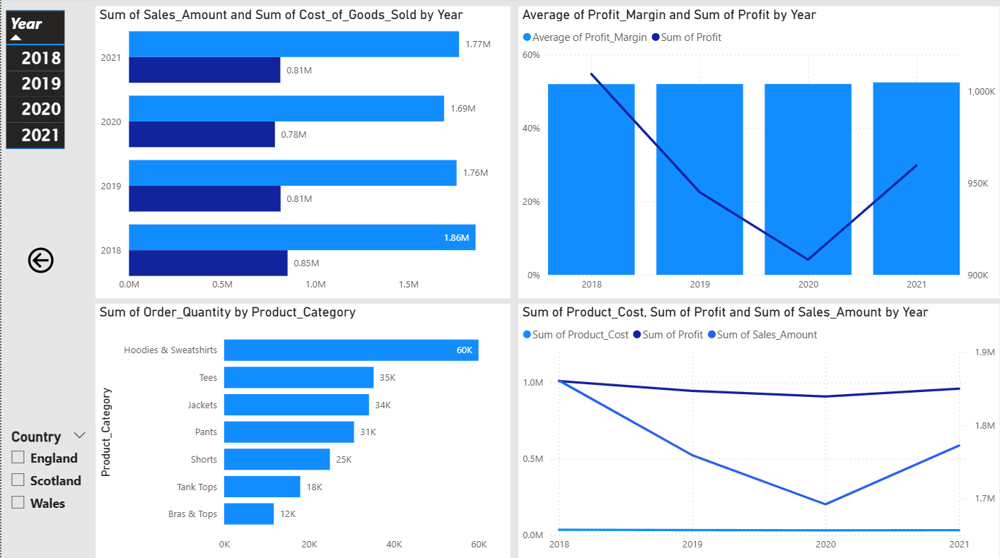
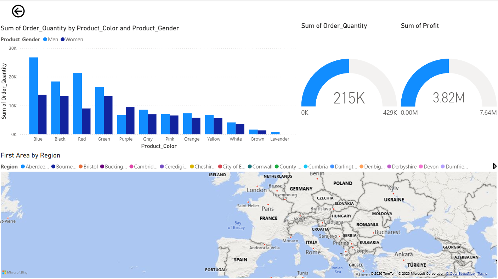
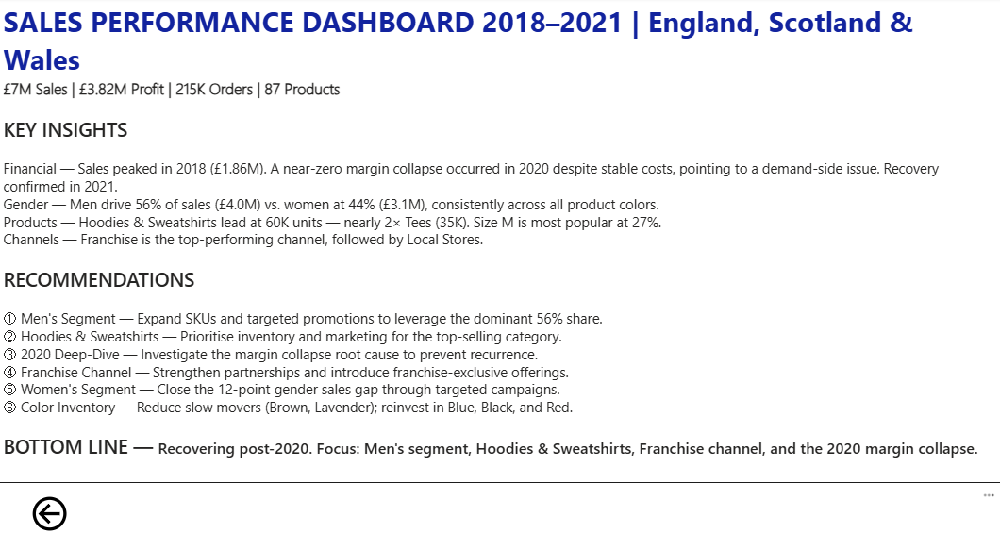

# Retail Sales Performance Analysis (Power BI)

---

## 📊 Project Overview

This Power BI dashboard provides a strategic analysis of a £7M retail operation across England, Scotland, and Wales (2018–2021). The goal was to transform raw sales, product, and customer data into actionable business insights regarding profitability, product performance, and operational efficiency.

---

## 🖥️ Dashboard Preview

### Home

### Sales Overview

### Financial Trends

### Color & Gender Insights

### Executive Summary

---

## 🔧 Step-by-Step Transformation

Using Power BI and DAX, I followed these steps to build a reliable analysis:

1. **Data Modeling:** Imported raw CSV and Excel files, creating relationships between sales, products, and geography to build a solid data foundation.
2. **Data Cleaning:** Audited the datasets to ensure currency consistency and handled missing values in the regional categories.
3. **KPI Logic (DAX):** Wrote custom DAX measures to calculate:
   - **Profit Margin %:** To see which products were actually making money after costs.
   - **Sales by Gender:** To compare performance across customer segments.
   - **Year-over-Year (YoY) Growth:** To compare current performance against previous periods.
4. **Interactive Design:** Built an Executive Summary view that allows management to filter by region or year to see instant results.

---

## 💡 What the Data Told Me

- **2020 Margin Collapse:** Profit margin dropped to near zero in 2020 despite stable costs — pointing to a demand-side issue. Recovery was confirmed in 2021.
- **Gender Gap:** Men account for 56% of total sales (£4.0M) vs. women at 44% (£3.1M), consistently across all product colors.
- **Top Category:** Hoodies & Sweatshirts lead all categories at 60K units — nearly double Tees (35K).
- **Top Colors:** Blue, Black, and Red dominate sales across both male and female segments.
- **Channel Performance:** Franchise is the top-performing retail channel, followed by Local Stores.

---

## 🛠️ Tools Used

| Tool | Purpose |
|---|---|
| Power BI | Dashboard design & visualization |
| DAX | Custom measures & KPI calculations |
| Excel / CSV | Raw data source |
| GitHub | Project hosting & documentation |

---

## 📬 Contact

- **Name:** Assem Mohamed
- **GitHub:** [assemmohamed662-gif](https://github.com/assemmohamed662-gif)
