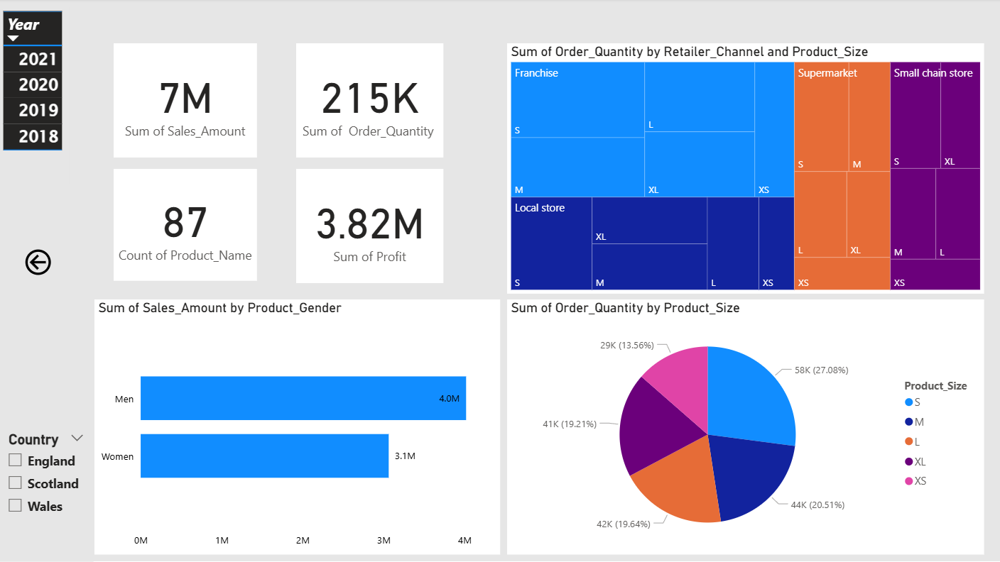

# Retail Sales Performance Analysis (Power BI)

## 📊 Project Overview
This Power BI dashboard provides a strategic analysis of a $7.08M retail operation. The goal was to transform raw sales, product, and return data into actionable business insights regarding profitability and operational efficiency.

## 📷 Dashboard Preview

## 🔍 Key Findings & Insights
* **High-Margin Performance:** The business maintains a robust **54% profit margin**, driven largely by the **Hoodies & Sweatshirts** category ($1.96M revenue).
* **Return Rate Opportunity:** Identified a peak **7.2% return rate** in lighter apparel (Tank Tops/Tees), suggesting a need for quality or sizing audits.
* **Market Concentration:** **88% of total revenue** is currently generated in England, highlighting a significant opportunity for expansion into Scotland and Wales.

## 🛠️ Skills & Tools Used
* **Data Modeling:** Integrated multiple CSV tables (Orders, Products, Returns, Retailers) into a star schema.
* **DAX:** Created custom measures for Profit Margin and Return Rate percentages.
* **Business Analysis:** Provided strategic recommendations based on data trends.
* **Data Visualization:** Designed a professional, multi-page layout for executive-level reporting.

## 🚀 Strategic Recommendations
1. **Audit High-Return Categories:** Investigate manufacturing specs for Tank Tops to protect net margins.
2. **Expand Regional Marketing:** Focus on under-penetrated markets in Scotland and Wales to diversify revenue.
3. **Optimize Inventory:** Prioritize high-volume, high-margin items like Hoodies for peak seasons.
